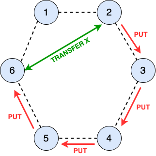
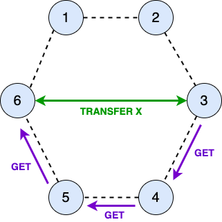
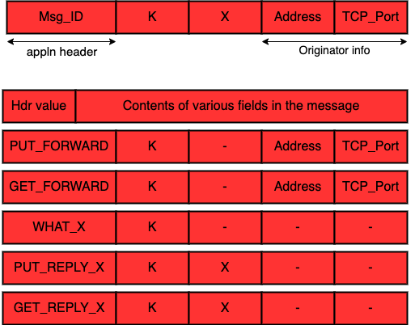

# Distributed Transparent Memory

Many nodes shared their local chunk of memory to form a big monolithic chunk of memory. Suppose there are 4 HDD each of which has a 2GB capacity working collectively to present a monolithic contiguous 8GB of HDD
to the user. Memory is distributed across nodes, but user is not aware of this distributedness. This is what Tannenbaum called Transparency. Such a memory model is used when volumnious amounts of data needs to be stored on several machines. For example, Hadoop Distributed File Systems (HDFS) is built on this model. In this project, I will build the distributed memory while the user would not have to keep track of the information about where data is located or being fetched from.

Regarding project deployment, I simulate 6 node topology by running the same process multiple times in different terminals of the same machine. So, we have a 6 node ring topology

User can perform two operations on each node:
* **PUT K X**, where K and X are two integers K=key and X=Value.
* **GET K**, where K is an integer, returns X for K.

Originator is a node on which the user has issued put/get request.

PUT request is uses when a user wants to save a (Key, Value) pair. Each node decides wether to save the pair in its local table or send it to a specific node in order to save it. The sending procedure should be done in UDP socket. The message type in this communication is called **PUT_FORWARD**. The content of the message includes IP address and TCP port of the originator. After receiving the message by the target node, the target node establishes TCP connection with the originator in order to obtain the value of X corresponded to K. The message that is sent through the TCP connection is called **WHAT_X**. The reply to this message is called **PUT_REPLY_X**.



The purpose of GET request is to fetch the value of X corresponding to the key K. According to below diagram, node 3 knows it does not have to fetch X against K from its local hash table, hence it forwards K to node 4 using UDP. The message id for this message is **GET_FORWARD**.




```
typedef struct appln_msg_{
  unsigned int msg_id;
  unsigned int k;
  unsigned int x;
  unsigned int address;
  unsigned int tcp_port;
}appln_msg_t;

```


